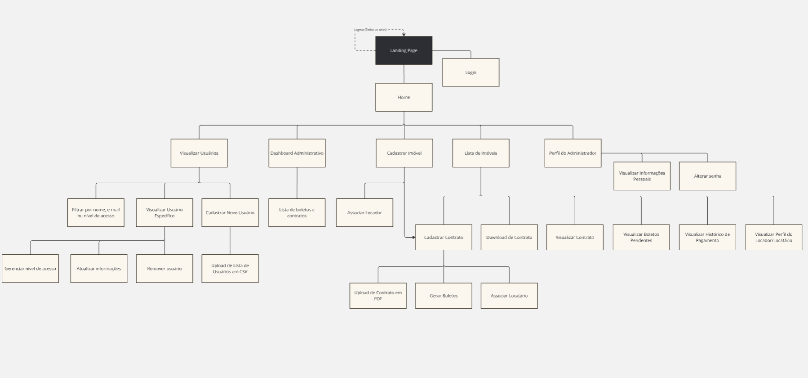

# Arquitetura da Informação

&emsp;&emsp; A arquitetura de informação é um dos pontos mais importantes para o desenvolvimento de um projeto, pois define a organização e a estrutura de um sistema. Ela determina como as informações serão organizadas, estruturadas e apresentadas ao usuário. Logo, facilita a navegação e a usabilidade do sistema, garantindo que os usuários encontrem rapidamente o que procuram e compreendam a estrutura do conteúdo.

&emsp;&emsp; Ela funciona por meio de blocos de informações, que são organizados de forma lógica e intuitiva, ligados entre si por meio de linhas. Isso representa a relação entre as informações e a hierarquia de cada bloco, facilitando a compreensão do conteúdo e a navegação do usuário, ou seja, cada componente representa uma página, um menu ou uma funcionalidade, enquanto as linhas representam que através deste é possível acessar outros componentes dentro do sistema.

&emsp;&emsp; A arquitetura da informação do projeto foi desenvolvida com base nas necessidades dos usuários e nas funcionalidades propostas, delimitadas através das user stories e requisitos da solução, respectivamente. A seguir, é apresentada a estrutura de cada perfil de usuário e, para visualizar a arquitetura com mais detalhes, acesse o [link](https://miro.com/app/board/uXjVK4sHs4Y=/?share_link_id=919332038595).

## Arquitetura da informação - Locatário
&emsp;&emsp; Locatário é o perfil de usuário que deseja visualizar seus imóveis alugados e gerir pagamentos e contratos. Portanto, a arquitetura da informação para esse perfil de usuário foi organizada de forma a facilitar a visualização e a gestão dos imóveis alugados.

    
 Arquitetura da Informação do Locatário 

    
    
<b>Fonte:</b> elaborado pela equipe.

## Arquitetura da informação - Locador
&emsp;&emsp; Locador é o perfil de usuário que deseja visualizar seus imóveis e verificar os pagamentos recebidos. Portanto, a arquitetura da informação para esse perfil de usuário foi organizada de forma a facilitar essa visualização de imóveis e gestão financeira, trazendo acesso direto a um relatório financeiro.

    
 Arquitetura da Informação do Locatário 

    
    
<b>Fonte:</b> elaborado pela equipe.

## Arquitetura da informação - Administrador
&emsp;&emsp; Administrador é o perfil de usuário que deseja visualizar e gerir todos os imóveis e usuários cadastrados no sistema, além de acesso de cadastro de todas as informações dentro da plataforma. Portanto, a arquitetura da informação para esse perfil de usuário foi organizada de forma que ele tenha acesso a todas as funcionalidades do sistema sem precisar de muitos cliques para acessá-las.

    
 Arquitetura da Informação do Locatário 

    
    
<b>Fonte:</b> elaborado pela equipe.

&emsp;&emsp; Tendo os diagramas de arquitetura da informação, é possível visualizar a estrutura do sistema e a relação entre as funcionalidades e os perfis de usuários. Dessa forma, é possível garantir que a navegação e a usabilidade do sistema seja eficiente no quesito de encontrar as informações necessárias em locais pertinentes. Além disso, atráves desta arquitetura é possível uma criação de wireframes mais assertiva e que realmente atenda as necessidades dos usuários.

