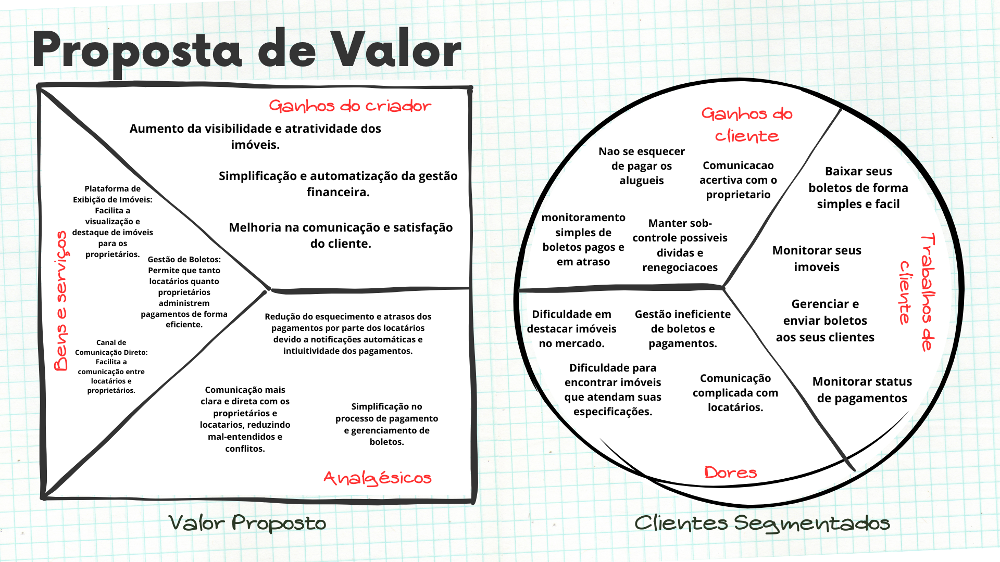

# Value Proposition Canvas

 
 

O Canvas de Proposta de Valor é uma ferramenta de estratégia de negócios projetada para ajudar a desenvolver produtos ou serviços alinhados com as necessidades específicas dos clientes. Desenvolvido por Alex Osterwalder, este modelo visual permite aos empreendedores e gerentes de produto identificar e comunicar claramente o valor que seus produtos ou serviços oferecem aos seus clientes.

 

A principal vantagem do Canvas de Proposta de Valor é sua capacidade de criar uma correspondência direta entre o que o produto oferece e o que o cliente realmente precisa ou deseja. Ele divide o processo em duas seções principais: o perfil do cliente e a própria proposta de valor. Isso inclui a identificação de problemas do cliente, os benefícios que o produto traz, e como esses benefícios solucionam esses problemas de uma maneira única.